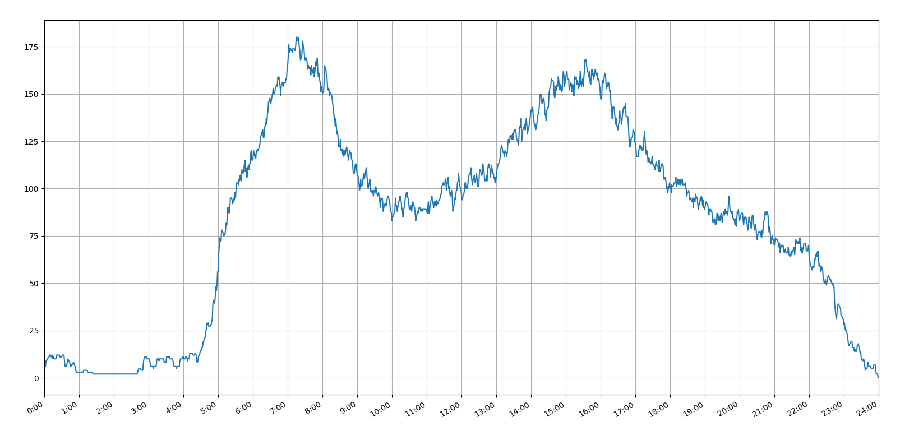
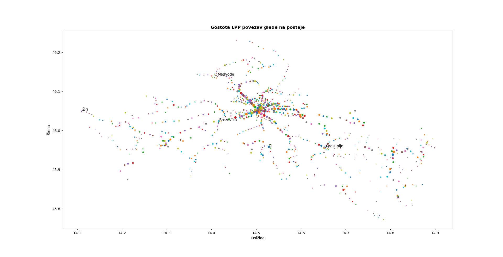

# Analiza Ljubljanskega potniškega prometa 

Projekt je bil narejen v okviru Fakultete za matematiko in fiziko predmeta Programiranje 2. Mentorja projekta sta **Lovro Šubelj** in **Matjaž Zaveršnik**. 

Zamisel projekta je bila analiza javnega prometa. Velik del kode je pridobivanje podatkov, sledi nekaj analize podatkov in na koncu grafična umestitev. Analizirala sva število avtobusov, ki so ob določeni uri na cesti ter narisala graf postaj, kjer velikost pike določa količino avtobusov, ki vozijo po teh postajah.

Za zagon programa odprite datoteko **"LPP.py"** in jo zaženite. Ker sta za pridobivanje podatkov potrebni 2 uri, je v datoteki **"LPP_pridobi_podateke.py"** shranjena koda, s katero pridobite podatke za nadaljni zagon datoteke **LPP.py**. Za delovanje programa potrebujemo python verzijo **3.6** ali več.   Za zagon programa potrebujete naslednje knjižnice:
1. matplotlib.pyplot  
2. numpy  
3. requests 
4. json

Slike:

Dominik Žnidaršič & Aleš Poklukar
